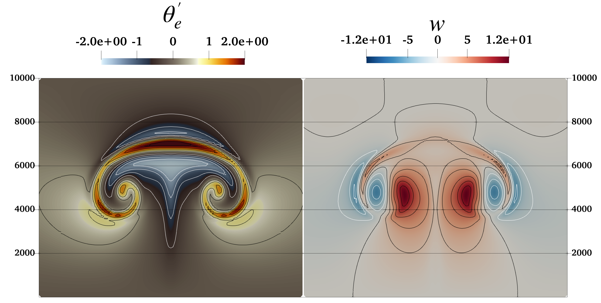

# Bubble Rise (moist and dry)

Results presented herein were generated with ERF hash: **9428c70** with [inputs file for dry bubble](https://github.com/erf-model/ERF/blob/9428c70c5c299fd8c11bc0b15634b917e16bdf7b/Exec/MoistRegTests/Bubble/inputs_BF02_dry_bubble) and [inputs file for moist bubble](https://github.com/erf-model/ERF/blob/9428c70c5c299fd8c11bc0b15634b917e16bdf7b/Exec/MoistRegTests/Bubble/inputs_BF02_moist_bubble).
    
Both the dry and moist case are two-dimensional with domain lengths $(L_x, L_z) = (20 \times 10^3, 10\times10^3)$ [m] and grid resolution of $(\Delta x, \Delta z) = (100, 100)$ [m]. Simulations were run for $1000$ [s] with an RK3 time-step of $\Delta t=0.5$ [s] and 4 acoustic sub-steps in the last RK stage. All boundary conditions are free-slip walls. The $3^{\rm rd}$ order upwind scheme was employed for the advection operator and the fluid was completely inviscid. Finally, we note that the non-precipitating version of the Kessler microphysics model was employed for the moist bubble case. 
    

(Left) $\theta_{d}^{\prime}$ contoured every $0.4$ [K] and (right) $w$ velocity contoured every $2$ [m/s]. Black contours are positive and white contours are negative.

(Left) $\theta_{e}^{\prime}$ contoured every $0.4$ [K] and (right) $w$ velocity contoured every $2$ [m/s]. Black contours are positive and white contours are negative.

