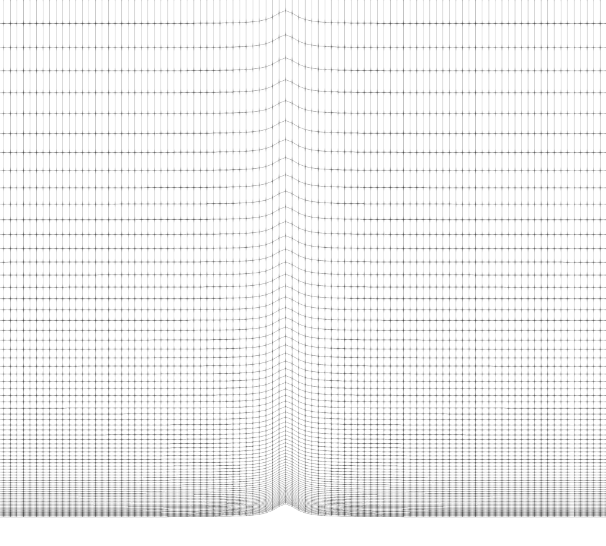
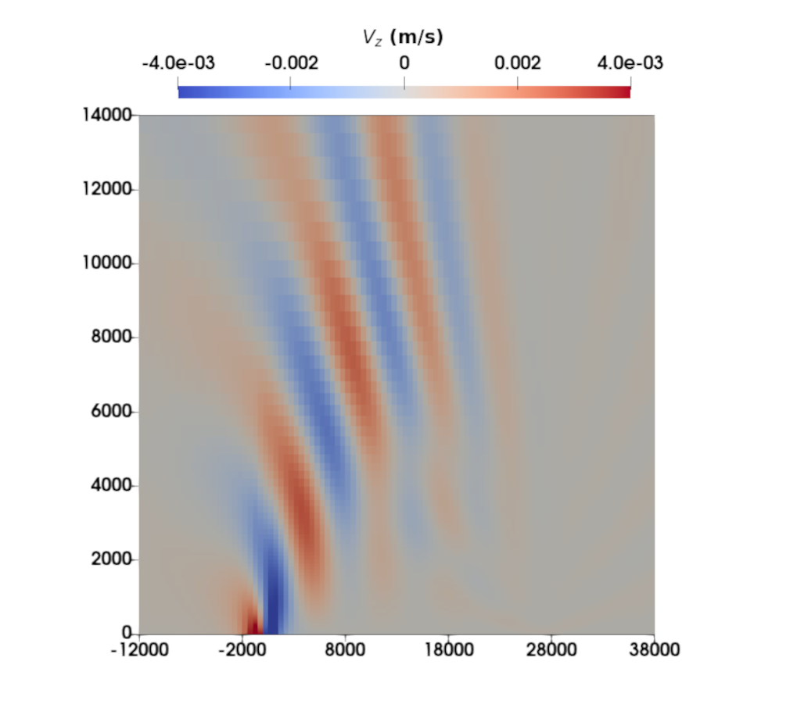

# Flow Over Terrain

Results presented herein were generated with ERF hash: **9428c70** and inputs file: `inputs name`.
     
Specification of the terrain height at the bottom of the domain follows $z(x) = \frac{h_{m} a^2}{\left( x - x_c\right)^2 + a^2}$, where $h_m$ = 1[m] and $a = 1000$ [m]. The domain lengths are $(L_x, L_z) = (144\times 10^3, 20\times 10^3)$ [m] and the  horizontal direction has a uniform grid resolution of $\Delta x = 500$ [m]. The mesh is geometrically stretched in the vertical to provide improved resolution near the hill; an initial spacing of 0.1 [m] and a stretching ratio of 1.05 is utilized in the vertical direction. The simulation is run for 3 hours, with an RK3 time step of 0.03 [s] and 4 acoustic sub-steps in the last RK stage. Inflow-outflow boundary conditions were applied in the stream-wise direction, with a 10 [m/s] inflow velocity, and slip walls were utilized at the top and bottom. The $3^{\rm rd}$ order upwind scheme was used for advection. This test case is purely inviscid and dry.

Vertically stretched mesh for the *Witch of Agnesi* (WOA) hill.

Vertical velocity profile for the *Witch of Agnesi* (WOA) hill.