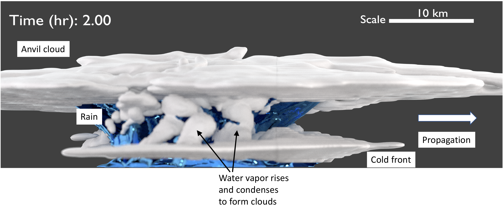
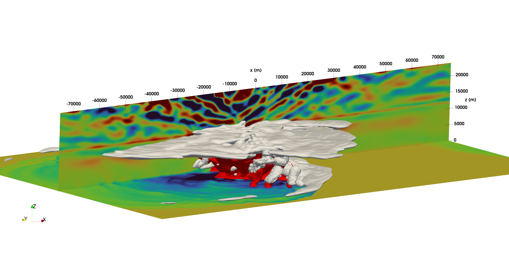

# Three-dimensional super cell

*Ray trace rendering of the supercell evolution highlighting the main features. Isocontours of cloud water (`$q_c = 10^-5$` [kg/kg]) in white and rain water (`$q_r = 10^-4$` [kg/kg]) in blue are shown.*

---

Isocontour of cloud water mixing ratio (`$q_c = 10^{-5}$` [kg/kg]) in white, rain water mixing ratio (`$q_r = 10^{-4}$` [kg/kg]) in red, and contours of potential temperature perturbation (y=0 and z=0 slices) (`$\theta_d^{\prime} = \theta_d(t) - \theta_d(0)$` [K]) at $t = 1800$ s, and 7200 s, and the total rain accumulation on the ground in mm at $t = 7200$ s (top to bottom).

$\frac{\partial\rho}{\partial t} = -\frac{1}{\alpha(t) V}\int\limits_{\partial\Omega(t)}\rho\mathbf{u}\cdot\mathbf{n} \ dA$  

*Evolution of the three-dimensional supercell: Isocontour of cloud water mixing ratio (`$q_c = 10^{-5}$` [kg/kg]) in white, rain water mixing ratio (`$q_r = 10^-4$` [kg/kg]) in red, and contours of potential temperature perturbation (`$y=0$` and `$z=0$` slices) (`$θ_d = θ_d(t)-θ_d(0)$` [K]) at t = 1800s, and 7200s, and the total rain accumulation on the ground in mm at t = 7200s (top to bottom).*

