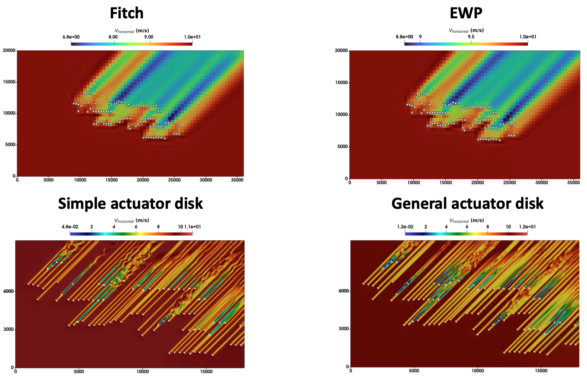

# Wind farm models

ERF supports four wind farm parameterizations that may be broadly grouped into mesoscale (Fitch, EWP) and LES (SAD, GAD) models. LES models employ grid spacings of $\mathcal{O}(10)$ [m] in all directions, whereas mesoscale models utilize $\mathcal{O}(10^2)$ [m] in the horizontal direction and $\mathcal{O}(10)$ [m] in the vertical. Consequently, mesoscale wind farm models are more appropriate for capturing farm--farm interactions, since they have potentially multiple turbines per cell, while LES models may capture turbine--turbine interactions. Mesoscale models generally assume the flow to be perpendicular to the turbine disk, and the area swept out by the turbine blade is only resolved in the vertical direction. By contrast, the increased resolution offered by LES models does allow them to resolve the area swept out by a turbine blade.

The SAD model uses horizontal momentum sources that are based on one-dimensional momentum theory, whereas the GAD model computes momentum sources for all coordinate directions and is based on blade element theory, accounting for blade geometry. A detailed discussion of all the models and source terms is beyond the scope of this paper, and we refer the interested reader to the cited work in section [Forcings](#forcings).

To evaluate ERF's wind turbine parametrizations, simulations of the King Plains wind farm, from the AWAKEN benchmark [Bodini et al., 2024, *AWAKEN webpage*](https://example.com), were completed under idealized conditions, i.e., dry, inviscid flow with no terrain. An inflow of 10 [ms$^{-1}$], at an angle of 45$^{\circ}$ to the horizontal, was specified with all turbine disks perpendicular to the flow. A total simulation time of 1 [hr] was completed with the domain size, mesh size, and time steps given in Table [Wind Farm Models](#wind_farm_models). A slip wall was utilized for the bottom boundary, and outflow conditions were imposed on all other boundaries. The 3$^\text{rd}$ order upwind scheme was used for advection, and acoustic substepping was used for time advancement with 4 acoustic substeps in the last RK stage.

Contours of instantaneous horizontal velocity magnitude, at the hub height of 89 m, are illustrated for each wind farm model in Figure [Wind Farm Models](#windfarm_models). Due to the larger grid size (500 [m] in the horizontal), Fitch and EWP models do not resolve individual wakes generated by a turbine. At LES grid sizes (20 [m] in all directions), the actuator disk models are able to resolve the wake deficits from individual turbines. Furthermore, the ensuing velocity deficits for the actuator disk models are larger than the mesoscale models, which will impact the predicted power output.

  
*Figure 1: WindFarmModels.*
